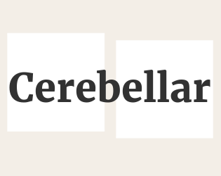

# About

Cerebellar is an interactive narrative for two players, made during [Train Jam 2016](https://itch.io/jam/train-jam-2016). This repository contains all of its source code and files.

In Cerebellar, two players on one keyboard control a pair of characters before and after their atoms are overlapped.

Cerebellar was developed by [Ghost Pattern](http://ghostpattern.net/), the collaboration between [Jason Bakker](http://twitter.com/jason_bakker) and [Russell Dilley](http://twitter.com/russelldilley). The audio was created by [Tomás Batista](http://tomasbatista.com/).

Cerebellar was built in Unity 5.3.4f1 using the [ink](http://www.inklestudios.com/ink/) scripting language, which was released as an open source project at GDC 2016 by its developer Inkle. Read more about Cerebellar and how it uses ink [here](http://ghostpattern.net/2016/04/04/cerebellar-is-now-open-source).

Cerebellar the game is freely available to download from [itch.io](https://ghostpattern.itch.io/cerebellar).

**Note:** Cerebellar uses an alpha version of ink, so there are some differences in format between what’s in our game and the latest version. These differences include:
 - Ink.Story.Begin no longer needs to be called.
 - Ink.Story is no longer created through a static factory method.
 - The ink syntax for "~ include" is now "INCLUDE".

# License

The MIT License (MIT)
Copyright (c) 2016 Ghost Pattern Pty. Ltd.

Permission is hereby granted, free of charge, to any person obtaining a copy of this software and associated documentation files (the "Software"), to deal in the Software without restriction, including without limitation the rights to use, copy, modify, merge, publish, distribute, sublicense, and/or sell copies of the Software, and to permit persons to whom the Software is furnished to do so, subject to the following conditions:

The above copyright notice and this permission notice shall be included in all copies or substantial portions of the Software.

THE SOFTWARE IS PROVIDED "AS IS", WITHOUT WARRANTY OF ANY KIND, EXPRESS OR IMPLIED, INCLUDING BUT NOT LIMITED TO THE WARRANTIES OF MERCHANTABILITY, FITNESS FOR A PARTICULAR PURPOSE AND NONINFRINGEMENT. IN NO EVENT SHALL THE AUTHORS OR COPYRIGHT HOLDERS BE LIABLE FOR ANY CLAIM, DAMAGES OR OTHER LIABILITY, WHETHER IN AN ACTION OF CONTRACT, TORT OR OTHERWISE, ARISING FROM, OUT OF OR IN CONNECTION WITH THE SOFTWARE OR THE USE OR OTHER DEALINGS IN THE SOFTWARE.
